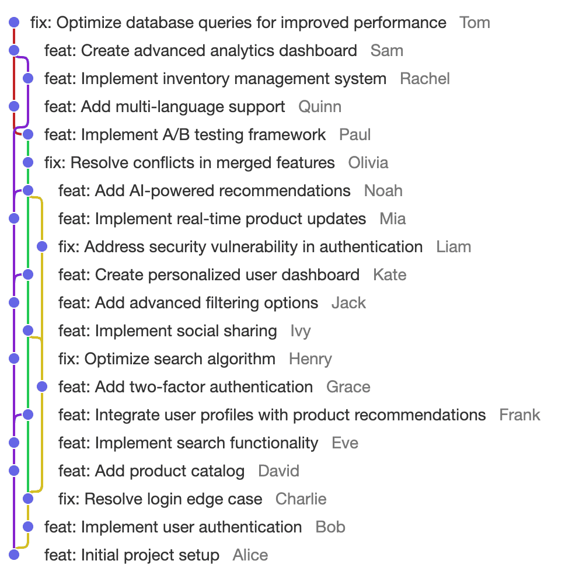

# DAG History Visualizer

This library helps you visualize the DAG history (like Git's commit graph).



This repository consists of a MoonBit package and a React component.

# MoonBit Package zxch3n/dag-view

## Example usage

```
struct TestDag {
  nodes : Map[String, @lib.Node]
}

fn gen_find(dag : TestDag) -> (String) -> @lib.Node? {
  fn find(id : String) -> @lib.Node? {
    let ans = dag.nodes.get(id)
    ans
  }

  find
}

let dag = {
nodes: {
    "1": @lib.Node::{ id: "1", lamport: 1, deps: [] },
    "2.1": @lib.Node::{ id: "2.1", lamport: 2, deps: ["1"] },
    "2.2": @lib.Node::{ id: "2.2", lamport: 2, deps: ["1"] },
    "2.3": @lib.Node::{ id: "2.3", lamport: 2, deps: ["1"] },
    "3.1": @lib.Node::{ id: "3.1", lamport: 3, deps: ["2.1", "2.2"] },
    "3.2": @lib.Node::{ id: "3.2", lamport: 3, deps: ["2.2", "2.3"] },
    "4.1": @lib.Node::{ id: "4.1", lamport: 4, deps: ["3.1"] },
    "4.2": @lib.Node::{ id: "4.2", lamport: 4, deps: ["3.2"] },
    "5": @lib.Node::{ id: "5", lamport: 5, deps: ["4.1", "4.2"] },
    "6.1": @lib.Node::{ id: "6.1", lamport: 6, deps: ["5"] },
    "6.2": @lib.Node::{ id: "6.2", lamport: 6, deps: ["5"] },
    "7": @lib.Node::{ id: "7", lamport: 7, deps: ["6.1", "6.2"] },
},
}
let view = @lib.visualize(gen_find(dag), ["7"])
inspect!(
  @lib.render_dag_as_text(view),
  content=
    #|   
    #| ⊙  7
    #| ├──╮ 
    #| │  │ 
    #| │  ⊙  6.2
    #| │  │ 
    #| │  │ 
    #| ⊙  │  6.1
    #| │  │ 
    #| ├──╯ 
    #| ⊙  5
    #| ├──╮ 
    #| │  │ 
    #| │  ⊙  4.2
    #| │  │ 
    #| │  │ 
    #| ⊙  │  4.1
    #| │  │ 
    #| │  │ 
    #| │  ⊙  3.2
    #| │  ├──╮ 
    #| │  │  │ 
    #| ⊙  │  │  3.1
    #| ├──┤  │ 
    #| │  │  │ 
    #| │  │  ⊙  2.3
    #| │  │  │ 
    #| │  │  │ 
    #| │  ⊙  │  2.2
    #| │  │  │ 
    #| │  │  │ 
    #| ⊙  │  │  2.1
    #| │  │  │ 
    #| ├──┴──╯ 
    #| ⊙  1
    #|   
    #|
  ,
)

let dag = {
  nodes: {
    "1": @lib.Node::{ id: "1", lamport: 1, deps: [] },
    "2": @lib.Node::{ id: "2", lamport: 2, deps: ["1"] },
    "b": @lib.Node::{ id: "b", lamport: 2, deps: ["1"] },
    "3": @lib.Node::{ id: "3", lamport: 3, deps: ["2"] },
    "4": @lib.Node::{ id: "4", lamport: 4, deps: ["3"] },
    "5": @lib.Node::{ id: "5", lamport: 5, deps: ["4"] },
    "6": @lib.Node::{ id: "6", lamport: 6, deps: ["5"] },
    "7": @lib.Node::{ id: "7", lamport: 7, deps: ["6"] },
    "a": @lib.Node::{ id: "a", lamport: 7, deps: ["b"] },
    "8": @lib.Node::{ id: "8", lamport: 8, deps: ["7", "a"] },
  },
}
let view = @lib.visualize(gen_find(dag), ["8"])
inspect!(
  @lib.render_dag_as_text(view),
  content=
    #|   
    #| ⊙  8
    #| ├──╮ 
    #| │  │ 
    #| │  ⊙  a
    #| │  │ 
    #| │  │ 
    #| ⊙  │  7
    #| │  │ 
    #| │  │ 
    #| ⊙  │  6
    #| │  │ 
    #| │  │ 
    #| ⊙  │  5
    #| │  │ 
    #| │  │ 
    #| ⊙  │  4
    #| │  │ 
    #| │  │ 
    #| ⊙  │  3
    #| │  │ 
    #| │  │ 
    #| │  ⊙  b
    #| │  │ 
    #| │  │ 
    #| ⊙  │  2
    #| │  │ 
    #| ├──╯ 
    #| ⊙  1
    #|   
    #|
  ,
)
```
